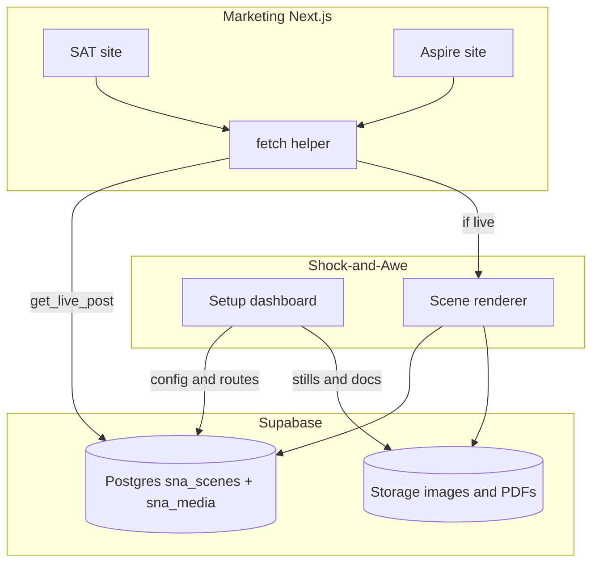

# Shock and Awe

A config-driven engine for **interactive scenes** — an executive desk, a planning board, an office environment, a server room. It is a standalone Next.js app. The two marketing sites ([securityawarenesstraining.ai](https://www.securityawarenesstraining.ai) and [aspiretss.com](https://aspiretss.com)) stay their own Next.js codebases. They do not copy this renderer. They ask a **fetch helper** whether a slug is a live scene.

- Engine internals: [`Shock_and_Awe_Technical_Spec.md`](Shock_and_Awe_Technical_Spec.md)
- SQL to run once: [`supabase/schema.sql`](supabase/schema.sql)
- Host helper: [`scene/host/client.ts`](scene/host/client.ts)

---

## Quick start

```bash
npm install
cp .env.example .env.local
npm run dev                    # http://localhost:3000
```

`/` is the operator index of live scenes. Setup is `/setup`. The NYC desk is `/nyc-security-desk`.

| Command | What it does |
|---|---|
| `npm run dev` | Regenerates the reserved-slug list, then starts Next |
| `npm run build` | Same, then a production build |
| `npm run typecheck` | `tsc --noEmit` |
| `npm run validate:scenes` | Slug collisions, canonical integrity, schema |

---

## Three codebases

```
  Setup (this repo) ──writes──► Supabase Postgres (scene JSON, brand routes)
                         └──► Storage buckets (images, PDFs only)

  SAT Next.js  ──fetch helper──► Supabase get_live_post(asat, slug)
  Aspire Next.js ──fetch helper──► Supabase get_live_post(aspire, slug)
                         └── if live ──► this engine /{slug}

  This engine ──reads──► sna_scenes (JSON is seed-only, never written back)
```



Visitor request on a marketing domain:

```
GET /some-slug
  → host catch-all
  → getLiveRoute(site, slug)     // post + media[], ~45s cache
  → miss: existing SAT/Aspire page or 404
  → hit: iframe or proxy SCENE_ENGINE_URL/some-slug
       → engine getByRoute → scene page
```

A new scene assigned in Setup is a new Postgres row. The next request on SAT or Aspire sees it. No host deploy. No per-scene `next.config` rewrite.

---

## Assign a scene to both brands

In `/setup`, each row has **SAT** and **Aspire** chips (`off` / `draft` / `live`). Click to add or drop that brand, then the existing save API writes the `routes[]` on the scene. The editor URL fold shows the same summary while collapsed (`URL · SAT live · Aspire off`).

- SAT (`asat`) → securityawarenesstraining.ai
- Aspire (`aspire`) → aspiretss.com
- New scenes start as SAT draft. Assignment is explicit.
- When both are live, SAT stays canonical; Aspire is typically `indexable: false`.

Video items keep an **external `src`**. PDF, image, card photo, and stage background are file uploads into Storage. Do not upload video.

On `/setup`, **Remove unused files** deletes `sna_media` rows and bucket objects that no scene config still points at.

---

## Supabase

Required for Setup writes. Without env vars the engine can still **read** a local JSON seed; create/update/delete and uploads return an error until keys are set.

1. Create a project.
2. Run [`supabase/schema.sql`](supabase/schema.sql) in the SQL editor (`sna_scenes`, `sna_media` with `scene_id` FK, `get_live_post` RPC, public buckets `scene-images` and `scene-docs`).
3. Put the project **URL** and **service role** key (server only) in `.env.local`.

| Layer | Holds |
|---|---|
| Postgres `sna_scenes` | Full `SceneConfig` jsonb, including text and brand routes |
| Postgres `sna_media` | Image/PDF rows keyed by `scene_id` (cascade on scene delete) |
| Storage | Image and PDF bytes (`scene-images`, `scene-docs`) |
| Not stored | Video files — link only. `content/scenes.json` is never written by Setup |

`get_live_post(site, slug)` returns the live scene `config` plus its `media[]`. Pass `slug` as null to list every live post for a site. Engine, Setup, and the host helper all use the service role — drafts never go to the browser.

Free-tier caps (public pricing): 500 MB database, 1 GB file storage, **50 MB max upload**. Dummy PDFs fit. Large video was never going to live here.

---

## Fetch helper (SAT and Aspire)

Copy [`scene/host/client.ts`](scene/host/client.ts) (or import it if you share this package). Env on **each host**, once (server only — same pair as this engine):

```
NEXT_PUBLIC_SUPABASE_URL=
SUPABASE_SERVICE_ROLE_KEY=
SCENE_ENGINE_URL=https://your-engine.example
```

One catch-all on the host — not a rewrite per slug:

```ts
import { getLiveRoute } from 'scene/host';
import type { SiteKey } from 'scene/types';

const SITE: SiteKey = 'asat'; // or 'aspire'

export default async function CatchAll({ params }: { params: { slug: string[] } }) {
  const slug = params.slug?.[0];
  if (!slug || params.slug.length !== 1) return null; // fall through to the rest of the app
  const route = await getLiveRoute(SITE, slug);
  if (!route) return null;
  // route.config and route.media[] come from get_live_post
  return (
    <iframe
      src={route.href}
      title={route.slug}
      className="h-screen w-full border-0"
    />
  );
}
```

`listLiveRoutes(site)` is the same `get_live_post` source (slug omitted) for a sitemap or nav. Cache is 45 seconds in-process. Helper prefers the RPC; if that is unset it falls back to `GET {SCENE_ENGINE_URL}/api/scene/navigate?site=`.

Wire `getLiveRoute` in host **middleware** (or a catch-all that only runs for unknown paths). If it returns a route, proxy or iframe `route.href`. If not, let the rest of the SAT/Aspire app handle the URL. Do not list slugs in `next.config` rewrites.

---

## How the engine request works

```
Request  →  middleware  →  app/[sceneSlug]/page.tsx  →  <Scene>
             │                    │                        │
      host → brand          source.getByRoute()      layout strategy
      old slug → 301        (brand, slug) → scene     positions items
                                                            │
                                                      SceneModal → viewer
```

Three things resolve independently:

| Concern | Resolved by | When |
|---|---|---|
| **Brand** | serving host | edge, in middleware |
| **Scene** | `(brand, slug)` via `SceneSource` | store / ISR |
| **Recipient** | `?r=` token | client, after first paint |

Recipient personalisation happens after first paint so a scene can be cached and still personalised.

---

## Project layout

```
Shock-and-Awe/
├── app/
│   ├── layout.tsx            brand-resolved metadataBase; analytics slot
│   ├── page.tsx              dev index of live routes (noindex)
│   ├── globals.css           design tokens + --brand-accent
│   └── [sceneSlug]/page.tsx  root catch-all, ISR, canonical + OG
├── middleware.ts             host → brand; old slug → 301
├── components/ui/            Button · Dialog · Skeleton · cn
│                             (API-compatible with the website's common/*)
├── scene/                    ── THE ENGINE ──
│   ├── types.ts              the entire contract
│   ├── sites.ts              brand registry, siteFromHost()
│   ├── track.ts              typed analytics events
│   ├── Scene.tsx             shell: open state, ?open= sync, recipient token
│   ├── SceneStage/…          stage, hotspots, nameplate, banner, mobile list
│   ├── SceneModal.tsx        the single overlay host
│   ├── layouts/              freeform (built) · grid · panorama
│   ├── viewers/              pdf · embed built; rest are Phase 3
│   ├── library/items.ts      shared item definitions
│   ├── configs/              scene records + validation
│   ├── source/               SceneSource: JSON → Supabase
│   └── host/                 fetch helper for SAT and Aspire
├── supabase/schema.sql       sna_scenes, sna_media FK, get_live_post, buckets
├── scripts/
│   ├── reserved-slugs.mjs    generates the collision guard list
│   └── validate-scenes.mjs   CI check
└── public/scene/
    ├── stages/               background artwork
    └── shared/               documents, video, audio reused across scenes
```

---

## Adding a scene

1. Drop the stage artwork in `public/scene/stages/`.
2. Create `scene/configs/<name>.ts` (copy `nyc-desk.ts`).
3. Register it in `scene/configs/index.ts`.
4. Run `npm run dev` and open `/<your-slug>?edit=1` to see the hotspot boxes while you position them.
5. `npm run validate:scenes` before committing.

### Which props get a hotspot

A prop earns a hotspot when it **carries content** — printed copy, a document, a
screen, a person. Set dressing does not: mugs, pens, plants and staplers stay
decorative however neat a metaphor they would make.

The reason is trust, not tidiness. A visitor who clicks a mug and gets a modal
learns that hotspots on this scene are unpredictable, and stops trying the ones
that matter.

Read the artwork before choosing a `kind`. A tablet showing a player at 02:45 is
a `video`. A cover with a signature on it is a `letter`, not a `pdf`. A button
that says DOWNLOAD BUNDLE is a `download`. Contradicting what the visitor is
looking at is the fastest way to make a scene feel broken.

Reference shared documents by key instead of redefining them:

```ts
items: [
  { ref: 'handbook', placement: { layout: 'freeform', x: 12, y: 60, w: 14, h: 20 } },
]
```

One edit to `scene/library/items.ts` updates every scene on both brands.

---

## Everything is dynamic

Nothing on a scene needs a code change. Documents, links, videos, files and the
scenes themselves all come from data.

### Point at any URL

`kind: "auto"` takes a URL and picks its own viewer at render time:

```json
{ "id": "x", "kind": "auto", "label": "Anything",
  "src": "https://www.youtube.com/watch?v=…" }
```

| You paste | It becomes |
|---|---|
| YouTube, Vimeo, Loom, Wistia, Dailymotion link | video embed (provider URL normalised) |
| `.mp4` `.webm` `.m3u8` | native player with quartile tracking |
| `.mp3` `.wav` `.m4a` | audio player with transcript |
| `.pdf` | inline PDF, searchable and printable |
| `.jpg` `.png` `.webp` `.svg` | image viewer, click to zoom |
| `.docx` `.xlsx` `.pptx` | Microsoft Office viewer when public, download otherwise |
| Google Drive / Docs share link | rewritten to `/preview` and framed |
| Dropbox link | rewritten to `raw=1` |
| `.zip` and other binaries | download |
| anything else | framed if allowlisted, otherwise a redirect |

Resolution happens at render, not at save. A link gains a better viewer as the
resolver improves, with nobody re-editing the content. Set `"as": "embed"` to
override when detection guesses wrong.

### Click behaviour

Clicking an item either opens the modal or navigates — never both. `scene/actions.ts`
decides once, and the hotspot renders the matching element: a `<button>` for the
modal, an `<a>` for anything that navigates. That is what keeps middle-click,
ctrl-click, "copy link address" and the browser status bar working.

| Item | Result |
|---|---|
| `link` | **redirects in the same tab.** Set `"target": "_blank"` per item to opt out |
| `scene` | redirects to the target scene's slug on the current brand |
| `download` | downloads the file; no modal, no navigation |
| `auto` → archive, unknown type | downloads or redirects |
| `auto` / `embed` on a non-allowlisted host | redirects to it in a new tab |
| everything else | opens in the modal |

A same-tab redirect tears the page down immediately, so outbound clicks are sent
with `sendBeacon` — an ordinary request is cancelled mid-flight and the click
never reaches analytics.

### Scenes without a deploy

```bash
NEXT_PUBLIC_SUPABASE_URL=https://xxxx.supabase.co
SUPABASE_SERVICE_ROLE_KEY=
```

Setup upserts `sna_scenes` only. If the table is empty, JSON in `content/scenes.json` (or compiled configs) is imported once. There is no write-back to disk.

Publishing goes live in seconds via `/api/scene/revalidate` (see `.env.example`).

### What replaces the compiler

TypeScript guaranteed config correctness while scenes lived in `.ts` files. The
moment they come from a CMS that guarantee is gone, so `scene/schema.ts` parses
everything at the source boundary:

- **Malformed config** — a bad item is dropped and logged; the rest of the scene
  still serves. A half-finished scene in the CMS should not take a live campaign
  offline.
- **Hostile URLs** — `javascript:` and `data:` hrefs are rejected outright. An
  editable `src` field is an injection surface.
- **Iframe hosts** — an iframe runs third-party code in the visitor's session on
  our origin, so only allowlisted hosts are framed. Anything else degrades to a
  link that opens under its own origin. Extend via `SCENE_EMBED_HOSTS`.

`npm run validate:scenes` runs the same checks in CI against a local content
file. A remote source is validated on every read instead — watch the server log.

---

## Two rules the design depends on

### `id` is immutable, `slug` is not

```ts
{
  id: 'nyc-financial-desk',            // analytics, scene graph, forever
  routes: [
    { site: 'asat',   slug: 'nyc-security-desk', canonical: true },
    { site: 'aspire', slug: 'nyc-desk', indexable: false },
  ],
}
```

Nothing internal references a slug. Rename a URL and historical reports, scene links and the item library all keep working; every previous slug lands in `slugHistory` and middleware 301s it. Campaign links live in sent emails and printed QR codes — they cannot be recalled, so they must keep resolving.

### An unset analytics ID renders no tag

```ts
const { gtmId } = SITES[site];
if (!gtmId) return null;        // never interpolate undefined into a URL
```

`next.config.mjs` fails the production build when a brand's container ID is missing. This is not hypothetical: the live NYC page currently requests `gtm.js?id=undefined` because an unset `NEXT_PUBLIC_*` variable is interpolated straight into the script URL. The tag loads, matches no container, and records nothing — silently.

---

## Reserved slugs

The scene route is a root-level catch-all, so static segments win. A scene slugged `pricing` would silently never render.

`scripts/reserved-slugs.mjs` builds the guard list from two sources:

- every top-level directory in this app's `app/`
- `scene/reserved.extra.json` — routes owned by *another* app on the same domain

That second file is currently seeded with the 25 top-level routes from the main website. **Keep it in sync if this engine ever shares a domain with that site**; if it always runs on its own domain or subdomain, you can empty it.

`validate:scenes` fails the build on a collision, a duplicate slug, a missing parent or scene-link target, or a scene indexable on both brands with no canonical route.

---

## Environment

| Variable | Purpose |
|---|---|
| `NEXT_PUBLIC_GTM_ASAT` | GTM container for securityawarenesstraining.ai |
| `NEXT_PUBLIC_GTM_ASPIRE` | GTM container for aspiretss.com |
| `NEXT_PUBLIC_FORCE_SITE` | `asat` \| `aspire` — override host resolution locally |
| `NEXT_PUBLIC_SUPABASE_URL` | Shared project URL (engine + host helper) |
| `SUPABASE_SERVICE_ROLE_KEY` | Server-only. Setup, engine, and host helper. Never expose to the browser |
| `SCENE_ENGINE_URL` | Public origin of this app, for host iframes/proxy |
| `SKIP_ENV_CHECK=1` | Allow a production build with no analytics IDs |

On `localhost` the host matches neither brand, so resolution falls back to `DEFAULT_SITE` (`asat`). Use `NEXT_PUBLIC_FORCE_SITE=aspire` to see the other brand without editing your hosts file.

---

## Status

**Built and verified** — `tsc --noEmit` clean, `next build` clean, both routes prerendering.

| Area | State |
|---|---|
| Contract, brand registry, source adapter | Done |
| Freeform layout, stage, hotspots, modal | Done |
| All 14 viewers (`auto`, `pdf`, `pages`, `embed`, `image`, `video`, `audio`, `card`, `letter`, `form`, `link`, `download`, `scene`) | Done |
| Universal media resolver — any URL picks its own viewer | Done |
| Runtime schema validation + URL safety guards | Done |
| Runtime scene source (JSON, optional Supabase) | Done |
| Fetch helper for SAT / Aspire hosts | Done |

| vCard generation from card config | Done |
| Mobile list view | Done |
| Reserved-slug + dynamic content validation | Done |
| Flipbook page-turn animation | Deferred — `flipbook` renders via `pages` |
| Scene graph breadcrumbs and transitions | Phase 4 |
| Recipient resolution endpoint, CRM alerting | Phase 5 |
| Grid layout (plan boards) | Phase 6 |

---

## Using the engine from SAT or Aspire

Do not copy `scene/` into those apps. Copy [`scene/host/client.ts`](scene/host/client.ts), set the three env vars, and add the catch-all above. This engine keeps viewers, pdf.js, and Setup.
