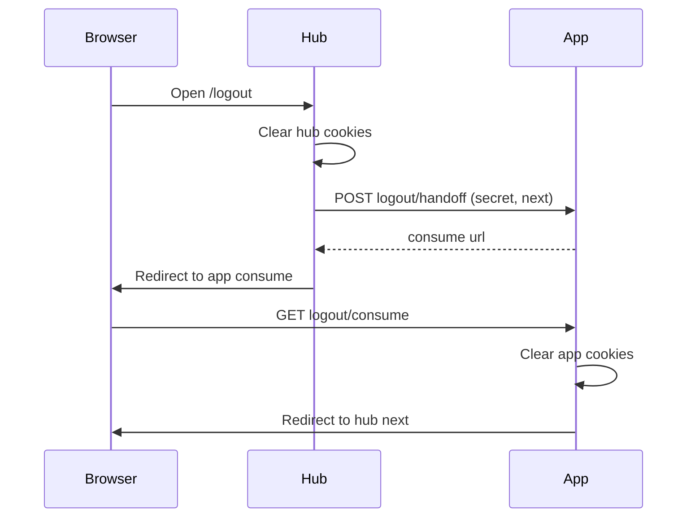

# Logout sync — hub + connected apps

Use this when several apps share one dashboard login channel but keep **their own** auth cookies on their own origins. Signing out on the hub (or in one app) must clear every origin the user may still hold a session on.

This guide is for **any** connected app and the hub that fans out logout. Login handoff is separate: see [`login-channel.md`](login-channel.md).

---

## Core rule

A server `fetch` from the hub **cannot** clear the user’s browser cookies on another origin. Same as login:

1. **Mint** a one-time logout URL on the app’s server (shared secret).
2. **Redirect the browser** to that consume URL so cookies clear on the app’s origin.
3. The app redirects the browser onward to a trusted hub URL (`next`).

Never call an app’s logout consume URL with a server-side `fetch` and expect the user’s session to die.

---

## What each side must implement

### Connected app

| Piece | Role |
|---|---|
| Own session cookies | On the app origin only |
| `POST …/logout/handoff` | Hub-only mint. Auth with shared secret. Body may include `next` (absolute URL on the **hub** origin). Returns a consume `url`. |
| `GET …/logout/consume?code=…&next=…` | Browser-only. Redeem code, clear app cookies, redirect to trusted `next` (or hub home). |
| Local Sign out | Clear **this** origin, then top-level navigate (GET) to the hub’s SPA `/logout` page — the same entry the hub’s own “log out all apps” uses. |
| Env | `HANDOFF_SECRET` (same as login). Hub public origin (e.g. `DASHBOARD_URL`) for “return to hub” and for validating logout `next`. Optional override for the hub logout URL if it is not `{hub}/logout`. |

**Why `/logout` on the hub, not `/api/auth/logout`:** Hub session cookies live on the SPA origin. The SPA logout page clears them and starts fan-out. An API route that only 302-bounces to `/logout` with an absolute `Location` built from a proxied `Host` header often drops the port (`http://localhost/logout` instead of `http://localhost:8102/logout`). Prefer navigating straight to the SPA path, or use a **relative** `Location: /logout`.

### Hub (dashboard / CMS)

| Piece | Role |
|---|---|
| SPA `/logout` | Clear hub session cookies, then fan out to connected apps. |
| Fan-out | For each app that may still be signed in: server-mint that app’s logout handoff, then **redirect the browser** to the returned consume `url`. |
| Chain | If several apps need clearing, chain hops (app A consume `next` → hub hop or next app consume → … → hub login). The hub owns the app list; apps do not. |
| Env | Per-app public URL + shared `HANDOFF_SECRET`. Optional internal mint URL if Docker cannot reach the public hostname. |

---

## Flows

### A. Sign out starts on the hub



1. User hits hub Sign out / log out all apps → hub `/logout`.
2. Hub clears its own session.
3. Hub mints app logout handoffs and redirects the browser through each consume URL.
4. User lands on hub login (or equivalent).

### B. Sign out starts in a connected app

1. App clears **its** cookies.
2. Browser top-level navigates to `{HUB_ORIGIN}/logout`.
3. Hub clears itself and fans out to any **other** apps still holding a session (re-clearing the app that already signed out is harmless if you use one uniform loop).
4. User lands on hub login.

If the app has no hub URL configured, Sign out only clears the app and stays on the app’s login page.

---

## App API sketch

Paths below are conventional (`/api/auth/…`). Use the same shape your login channel already uses.

### Mint (hub → app server)

```
POST {APP_ORIGIN}/api/auth/logout/handoff
Authorization: Bearer <HANDOFF_SECRET>
Content-Type: application/json
```

```json
{
  "next": "https://hub.example.com/login"
}
```

- `next` optional. When set, must be an absolute `http:`/`https:` URL on the **hub** origin the app trusts.
- When omitted, the app should default `next` to the hub home so the user is not left on the app’s `/login`.

`200`:

```json
{
  "ok": true,
  "url": "{APP_ORIGIN}/api/auth/logout/consume?code=…&next=…",
  "expires_in": 60
}
```

| Status | Meaning |
|---|---|
| 400 | `next` not on the hub origin |
| 401 | Wrong secret |
| 501 | Secret unset on the app |
| 503 | Auth not configured on the app |

Also accept `x-handoff-secret: <HANDOFF_SECRET>` if you already do for login.

### Consume (browser only)

Browser loads `url` from the mint response. App clears cookies, then redirects to `next`. Codes should expire quickly (~60s) and be one-use.

Do **not** send login JWTs in the logout mint body. Logout only needs the secret and optional `next`.

### Hub mint example

```js
// After clearing hub cookies on your origin…

const mint = await fetch(`${process.env.APP_ORIGIN}/api/auth/logout/handoff`, {
  method: 'POST',
  headers: {
    authorization: `Bearer ${process.env.HANDOFF_SECRET}`,
    'content-type': 'application/json',
  },
  body: JSON.stringify({
    next: `${process.env.HUB_PUBLIC_ORIGIN}/login`,
  }),
});

const body = await mint.json();
if (!mint.ok || !body.url) {
  return Response.redirect('/login'); // app may still be signed in
}

return Response.redirect(body.url, 302); // browser clears app, then returns to next
```

Repeat mint → browser redirect for each other app before or after, depending on your chain.

---

## Env checklist

| Where | Variable | Purpose |
|---|---|---|
| Hub + each app | `HANDOFF_SECRET` | Same value; server only |
| Each app | Hub public origin (e.g. `DASHBOARD_URL`) | Validate logout `next`; Sign out → hub `/logout` |
| Hub | Each app’s public origin | Build handoff/mint URLs the browser can open |
| App (optional) | Full hub logout URL override | If logout is not `{hub}/logout` |

---

## Pitfalls

- **Server-fetch consume** — cookies never clear for the user.
- **Absolute redirect with wrong Host** — behind Docker/nginx, `Host` without port becomes `:80`. Prefer relative `Location` or a configured public origin that includes the port.
- **Leaving users on the app `/login` after hub-initiated logout** — default `next` to the hub home when omitted.
- **Putting `HANDOFF_SECRET` in the client bundle** — never.
- **Assuming one shared cookie domain** across apps — each origin clears itself.
- **In-memory one-time codes in Next.js dev** — module Maps can wipe when a route first compiles; keep tickets on `globalThis` (or another store that survives HMR) in the same process.

---

## Related

| Doc | Topic |
|---|---|
| [`login-channel.md`](login-channel.md) | Login handoff (mint + consume) for this app |
| [`login-instruct.md`](login-instruct.md) | How another app accepts hub login |
| [`.env.example`](../.env.example) | `HANDOFF_SECRET`, `DASHBOARD_URL`, `DASHBOARD_LOGOUT_URL` |
